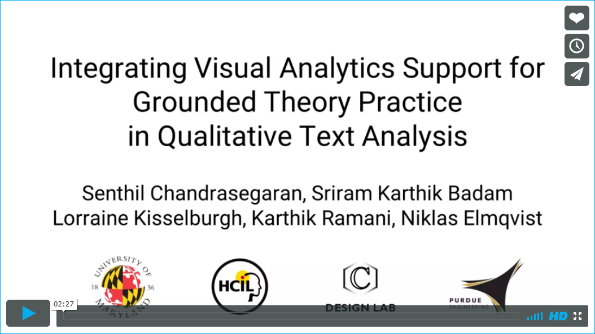

# Textplorer

Textplorer is a web-based visual analytics tool to help the qualitative analyst in the Grounded Theory Method.
Grounded Theory is a general method of developing theoretical constructs
inductively from data sources gathered as a part of a qualitative
research study.
It uses a "construct-oriented approach" where the analyst creates
categories based on patterns in the data.
These categories are further grouped into higher-level categories, and
relationships (especially causal) between categories are identified.
Finally a "core concept" is chosen among these categories, and based on
the relationships identified, a theory is formed.

Textplorer uses natural language processing (NLP) techniques along with
interactive text visualizations to help the user explore the text data,
identify concepts of interest, and establish relationships between these
concepts.

## Publication
Textplorer was developed as part of a paper presented at EuroVis 2017.
The full citation, link to the pdf, and a video demo are shown below.

Chandrasegaran, S., Badam, S.K., Kisselburgh, L., Elmqvist, N., and
Ramani, K. _Integrating Visual Analytics Support for Grounded Theory
Practice in Qualitative Text Analysis_. Computer Graphics Forum (Proc.
EuroVis), 36 (3), pp. 201–212, 2017.

[(**Download Paper**)](https://senthilchandrasegaran.github.io/pages/pubs/pdfs/gthelper.pdf)

[](https://vimeo.com/194922904 "Click to play video")


## Installation Instructions
We use the Stanford Parts-of-Speech (POS) Tagger and the Stanford Named
Entity Recognition (NER) Tagger, which require a little setup in Java.
So before installing Textplorer, perform the following steps first.

### Install Stanford NER & POS Taggers

1. Install JDK (v > 1.8), and add the path to the bin file (e.g.
  `C:/Program Files/Java/jdk1.8.0_101/bin` to the environment variable
  `JAVAHOME`. Create the variable if it does not exist already.
2. Download the [Stanford Named Entity Recognizer](http://nlp.stanford.edu/software/CRF-NER.html#Download)
  and extract its contents to a folder, say `C:/StanfordNER/`
3. Add `C:/StanfordNER` to the `CLASSPATH` environment variable (create
the variable if it does not exist).
4. Download the [Stanford CoreNLP models](http://nlp.stanford.edu/software/stanford-english-corenlp-2015-12-11-models.jar)
  and extract the files. Copy the folder `nlp` from
  `stanford-english-corenlp-20YY-MM-DD/edu/stanford/` and place it in
  `C:/StanfordNER`.

### Install Textplorer
Textplrorer's server uses the [Node.js](https://nodejs.org/) runtime, so
it needs to be installed first, in order to install all related
libraries.

1. Make sure Node.js and Python are installed on your system
2. Install the [NLTK package](http://www.nltk.org/install.html) for
  Python.
2. Download the source code
  [as a zip file](https://github.com/senthilchandrasegaran/textplorer/archive/master.zip)
  or clone the repository by typing the following command on the terminal:

   ```shell
   $ git clone https://github.com/senthilchandrasegaran/textplorer.git
   ```

3. On the Node.js Command Prompt (for Windows) or Terminal (for OS X), navigate to the main folder (the one that contains the file `textplorer.js`) and type in:

   ```shell
   $ npm install
   ```

This installs all required modules.

**NOTE:**
This setup has been tested only on Windows.
Updating the path variables in the file
`public/pythonscripts/infoContent.py` to reflect the paths of the
Stanford NER and POS Taggers should work, but proceed at your own risk.

## License
Released under [BSD license](https://opensource.org/licenses/BSD-3-Clause).
Copyright 2017 [Senthil Chandrasegaran](https://github.com/senthilchandrasegaran).
